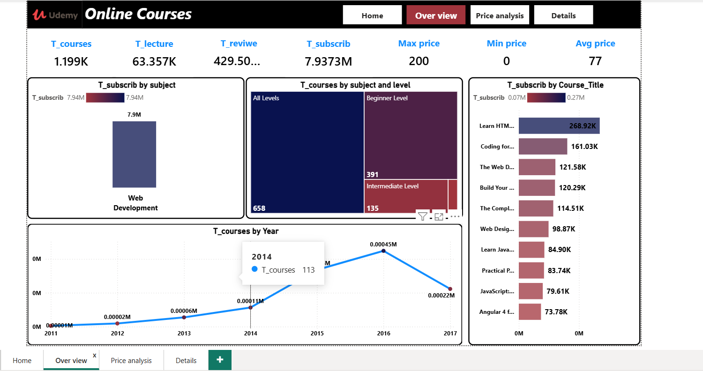
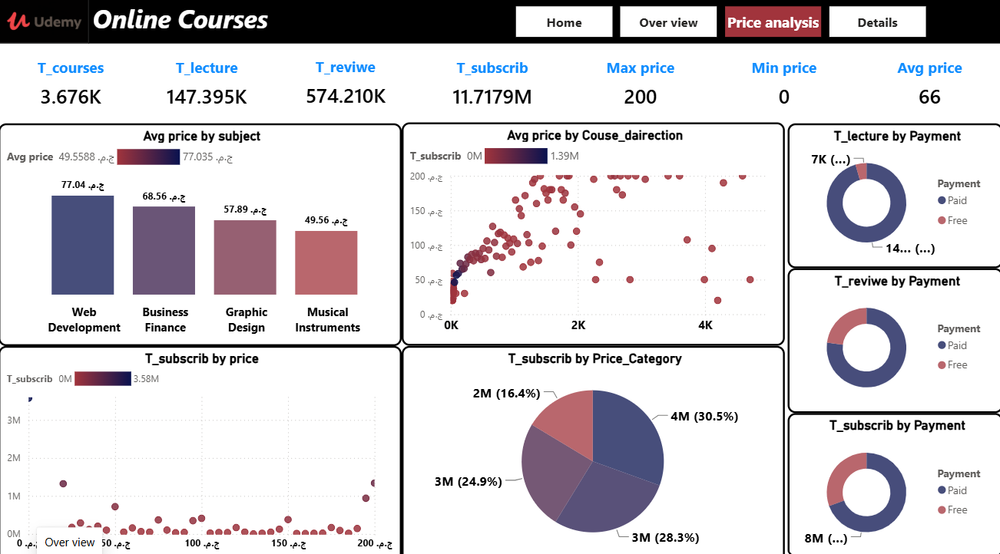
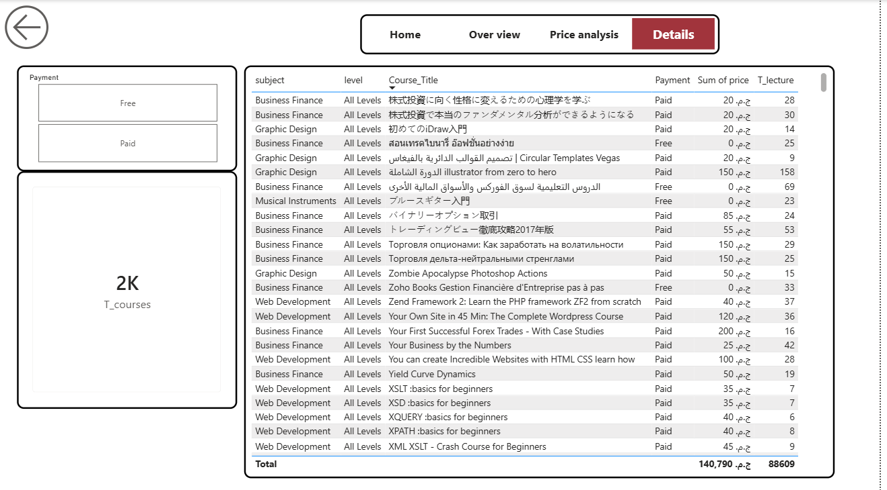

# 📚 Udemy Online Courses Performance & Pricing Analysis

## 📌 Project Overview
An end-to-end interactive Power BI dashboard built to analyze Udemy's course catalog performance. The analysis explores 3.67K courses to unpack key business drivers: subscriber engagement, revenue/price distribution, content volume (lectures), and target audience levels.

---

## 📊 Key Highlights & Data Insights

* **Portfolio Scale:** Processed and analyzed **3.67K total courses** comprising **147.39K lectures** and **574.21K user reviews**.
* **Audience Reach:** Analyzed patterns across **11.71M total subscribers**.
* **Pricing Dynamics:**
  * Average Course Price: **$66** (ranging from **$0 / Free** up to **$200**).
  * Highest average pricing observed in **Web Development ($77.04)**, followed by **Business Finance ($68.56)** and **Graphic Design ($57.89)**.
* **Category Dominance:** **Web Development** is the single largest category by audience volume, accounting for ~7.9M subscribers.
* **Level Distribution:** Most offerings target **All Levels** (658) and **Beginners** (391), while **Intermediate** courses (135) make up a smaller niche segment.

---

## 🛠️ Tools & Technologies Used
* **Power BI Desktop:** Data modeling, custom DAX metrics, visual layout, dynamic page navigation, and bookmarking.
* **Power Query:** Data cleaning, attribute transformation, missing value handling, and data type alignment.

---

## 📂 Dashboard Architecture

The reporting solution consists of 4 dynamic pages designed to answer both high-level executive questions and deep-dive micro queries:

1. **Home:** Main landing view providing clean, quick navigation across all report analytical modules.
2. **Overview:** High-level executive KPIs, enrollment trends over time (peak growth in 2016), top-grossing/most-subscribed courses (e.g., *Learn HTML...* with 268.92K subscribers), and subject breakdowns.
3. **Price Analysis:** Comparative view examining paid vs. free course ratios across total lectures, user reviews, price distribution scatter charts, and revenue categories.
4. **Details:** Granular detail view equipped with dynamic filtering options (e.g., *Payment Type: Free / Paid*) and record-level metrics for deep inspection of individual course titles, pricing, and lecture counts.

---

## 📸 Dashboard Visuals

### 1. Overview Dashboard


### 2. Price & Revenue Analysis


### 3. Detailed Data & Drill-Downs


---

## 🚀 How to Run Locally
1. Clone this repository to your local machine:
   ```bash
   git clone [https://github.com/Ahmedkh26/udemy-courses-analysis.git](https://github.com/Ahmedkh26/udemy-courses-analysis.git)
